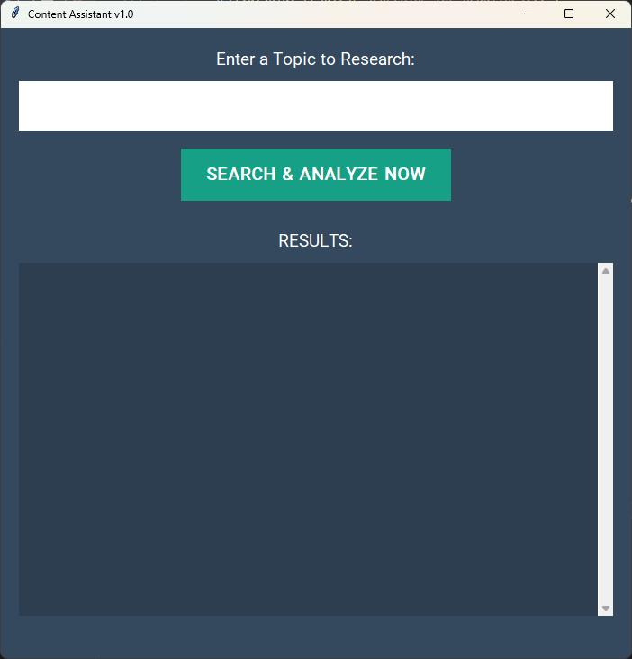

# Content Assistant: Research & Analysis Desktop App

A powerful desktop application that scrapes Google News for real-time headlines on any topic and analyzes them for sentiment and marketing power words.

## Features

*   **Real-time News Scraping:** Fetches the top 5 current headlines from Google News based on a user-provided topic.
*   **Sentiment Analysis:** Determines the sentiment (Positive, Neutral, Negative) of each headline using natural language processing.
*   **Power Word Identification:** Highlights impactful marketing "power words" found within headlines.
*   **User-Friendly GUI:** Intuitive graphical interface built with Tkinter for easy topic input and results display.
*   **Complete Workflow:** Orchestrates web scraping and NLP analysis into a single, seamless user experience.

## How to Run

1.  **Prerequisites:** Ensure you have Python 3.x installed.
2.  **Install Libraries:** If you don't have them already, install the required Python libraries:
    ```bash
    pip install requests beautifulsoup4 textblob
    ```
    (Tkinter is built-in with Python)
3.  **Save the Code:** Save the provided Python code as `content_assistant.py` in your desired directory.
4.  **Run the Application:** Open your terminal or command prompt, navigate to the directory where you saved `content_assistant.py`, and run:
    ```bash
    python content_assistant.py
    ```
5.  **Interact:** The application GUI will launch. Enter a topic (e.g., "artificial intelligence trends", "sustainable energy solutions") into the input field and click "SEARCH & ANALYZE NOW" to see the analyzed headlines.

## Demo



---

**Note:** Web scraping can be fragile. If the Google News website structure changes, the scraping functionality might break and require updates to the `scrape_google_news` function.